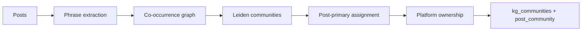

# NLP Graph Analysis

**Build lexical knowledge graphs from discussion text — for AI search optimization (GEO).**

Extract the exact phrases buyers use, cluster them into communities, and map which products/platforms own which language clusters. The goal is content that matches **verbatim search queries** (ChatGPT, Perplexity, Gemini) — not keyword stuffing or embedding similarity alone.

> *"You had a topical cluster of keywords. Now you're going to have a topical cluster of **questions**."* — Guy Yalif, Webflow

This repo is the **v2 rewrite** of the 2020–2024 research notebooks (spaCy + CountVectorizer + Louvain). Step 1 (Twitter API ingestion) is retired. Steps 2–3 are now an installable Python package: `nlp_graph`.

[](https://github.com/aliss77777/NLP-graph-analysis/releases/tag/v2.0.0b1)
[](https://www.python.org/)
[](LICENSE)

---

## Why lexical phrases, not embeddings?

AI search engines reward content that uses **literal buyer language**. Embedding similarity finds semantically related text; GEO optimization needs **exact phrase extraction** — "migrate off Snowflake", "dbt Cloud vs dbt Core", "Unity Catalog pricing".

We tested embedding-based community detection on a 17k-post corpus: it produced **2 communities**. A lexical phrase co-occurrence graph on the same domain produces **20+ meaningful clusters** in under 20 seconds. Communities are built from **TF-IDF 2–4 grams + Leiden**, not from vector space.

---

## How it works



| Step | What happens |
|------|----------------|
| **1. Ingest** | Load posts (parquet / CSV / JSONL) with `post_id`, text, optional `source_channel` and platform |
| **2. Extract** | TF-IDF 2–4 word phrases per post; channel stoplists; entity names separated from phrase graph |
| **3. Graph** | Phrase ↔ phrase edges via PMI co-occurrence (min count threshold) |
| **4. Cluster** | Leiden community detection on phrase graph |
| **5. Assign** | Each post gets **one primary community** (plurality of its extracted phrases) |
| **6. Rank** | Top phrases per community scored for B2B/domain signal (not graph degree) |
| **7. Export** | Parquet: communities, post assignments, nodes, edges, platform pivot |

**Reference scale:** ~16 seconds on ~11,700 synthetic B2B posts (laptop, no GPU).

---

## Try it (toy example)

```bash
git clone -b v2_AI_update https://github.com/aliss77777/NLP-graph-analysis.git
cd NLP-graph-analysis
python -m venv .venv && source .venv/bin/activate
pip install -e ".[dev]"

# 117-post stratified sample included in repo
build-lexical-kg \
  --input examples/posts_sample.parquet \
  --output-dir exports \
  --min-df 0.02 \
  --min-posts 5 \
  --resolution 1.0
```

Open `exports/kg_communities.parquet` and `exports/post_community.parquet` when done. See [examples/README.md](examples/README.md) for sample data details.

**Defaults** (`min_df=0.005`, `min_posts=25`) are tuned for **10k+ posts**. Use higher `--min-df` and lower `--min-posts` on small samples.

```bash
pytest   # unit tests
```

---

## Example output (reference build, ~11.7k posts)

From a full synthetic B2B corpus (data platforms: Databricks, Snowflake, dbt, Trino, etc.). **Not** what the 117-post toy sample produces — shown here to illustrate scale and signal quality.

| Community | Posts | Dominant phrase | Top platform | Share | Example phrases |
|-----------|-------|-----------------|--------------|-------|-----------------|
| 0 | 2,130 | unity catalog | AWS Redshift | 15% | unity catalog, migration from on, migration from |
| 2 | 1,414 | dbt cloud | dbt Cloud | 46% | dbt cloud, dbt core, dbt is |
| 4 | 1,124 | vendor lock-in | Vertex AI | 46% | vendor lock-in, vertex ai, migration to vertex ai |
| 3 | 969 | migration from our | Snowflake | 13% | migration from our, spark job, migration from our old |
| 7 | 715 | migration to | Google BigQuery | 14% | migration to, ms fabric, migration has been a disaster |
| 1 | 708 | pricing is | Google BigQuery | 29% | pricing is, serverless architecture, flat-rate pricing |
| 10 | 659 | microsoft fabric | Microsoft Fabric | 31% | microsoft fabric, migration project, fabric for |
| 5 | 714 | migration wasn | AWS Redshift | 13% | migration wasn, aws redshift, lakehouse platform |

**21 communities** · **11,753 / 11,770** posts with a primary assignment · top community phrases filtered for B2B/domain signal

Platform dominance is **strong in narrow clusters** (dbt Cloud 46%, Vertex AI 46%) and **weak in broad migration narratives** (~54% of post volume sits in communities with &lt;20% platform share). That reflects corpus composition, not a pipeline bug.

---

## Core components

```
nlp_graph/
├── ingest/posts.py          # parquet, CSV, JSONL loaders
├── extract/
│   ├── lexical.py           # TF-IDF phrases + B2B seed patterns
│   ├── ngrams.py            # channel-aware vectorizer
│   ├── channel_stoplist.py  # junk filters, domain allowlists
│   └── entities.py          # platform/product entity lists
├── graph/
│   ├── term_graph.py        # phrase co-occurrence (PMI)
│   └── communities.py       # Leiden (+ Louvain fallback)
├── summarize/
│   ├── post_community.py    # primary post → community assignment
│   ├── ranking.py           # B2B query-shape phrase ranking
│   └── top_terms.py         # community table + platform pivot
├── export/kg_parquet.py     # output schema
└── pipeline.py              # end-to-end orchestration
```

**Stubs (not yet implemented):** `extract/llm_phrases.py`, `extract/spacy_phrases.py`

---

## Assumptions

The reference build and included sample use **synthetic B2B SaaS posts** — generated for research, not scraped social media. See [examples/README.md](examples/README.md).

| Assumption | Detail |
|------------|--------|
| **Domain** | Data / AI platforms — migration, pricing, lakehouse, governance, vendor comparison |
| **Channels** | Reddit, Twitter/X, LinkedIn, G2-style reviews (different stoplists per channel) |
| **Corpus** | Reference: ~11,770 posts, 100% synthetic. Sample: 117 posts (1% stratified by channel) |
| **Text column** | `text`, `text_for_embedding`, or `title` + `body` |
| **Platform column** | `platform_mentioned`, `carrier`, or `platform` |

**Your mileage will vary** on real scraped corpora until stoplists, seed patterns, and `min_df` are retuned for your domain.

---

## What's invariant vs data-dependent

| Architecture (stable) | Tune per corpus |
|----------------------|-----------------|
| Lexical-only communities (not embedding-based) | `min_df`, `leiden_resolution`, `min_posts_per_community` |
| Post-primary assignment (plurality vote) | Channel stoplists (Reddit vs G2 vs LinkedIn) |
| 2–4 gram phrase extraction | `B2B_ALLOWLIST` / seed patterns for your domain |
| Entity nodes separate from phrase graph | Community count (graph density) |
| Query-shape phrase ranking | Junk filter sensitivity |
| Output schema | Platform dominance skew on narrative-heavy corpora |

---

## Outputs

| File | Description |
|------|-------------|
| `phrase_extractions.parquet` | post_id, phrase, TF-IDF score, channel, platform |
| `post_community.parquet` | **One primary community per post** + platform + phrase vote count |
| `kg_communities.parquet` | Community summary: top_terms (JSON), dominant phrase, platform % |
| `kg_nodes.parquet` | phrase, entity, and platform nodes |
| `kg_edges.parquet` | `co_occurs` and `owned_by` edges |
| `kg_platform_pivot.parquet` | Platform × community post counts |
| `lexical_kg_build_summary.json` | Build stats and config |

---

## v1 → v2

| v1 (notebooks) | v2 (package) |
|----------------|--------------|
| Unigram CountVectorizer | **2–4 gram TF-IDF** + domain seed patterns |
| Louvain on generic terms | **Leiden** on phrase co-occurrence graph |
| Manual topic labels | Ranked B2B phrases + platform ownership per cluster |
| Twitter CSV only | Parquet / CSV / JSONL |
| Jupyter-only | `pip install -e .` + CLI |

Legacy notebooks remain in the repo root for reference. Step 1 (Twitter API) no longer works as-is.

---

## Deeper documentation

[docs/V2_TRANSFORMATION_WORKPLAN.md](docs/V2_TRANSFORMATION_WORKPLAN.md) — design rationale, what we tried, what failed, and what we learned building v2 (including the filler-metrics false-pass story and post-primary assignment fix).

---

## Branches

| Branch | Contents |
|--------|----------|
| **`v2_AI_update`** | **v2 lexical KG package** (this README) |
| `main` | v1 research notebooks + pointer to v2 |

---

## License

MIT
